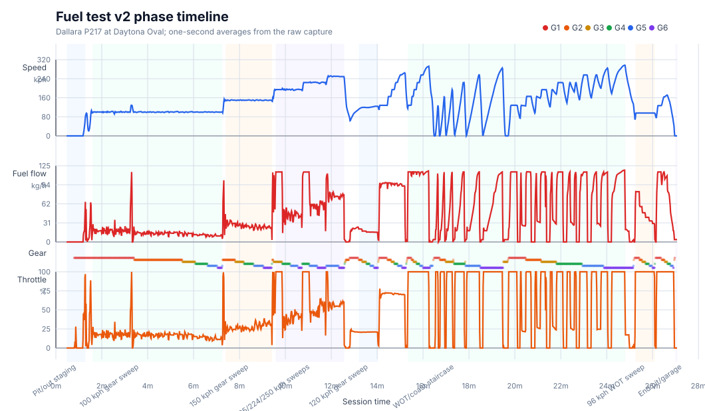
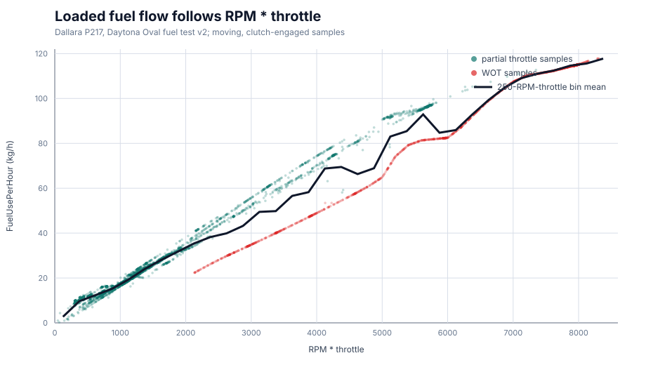
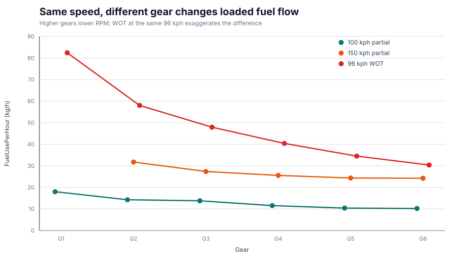
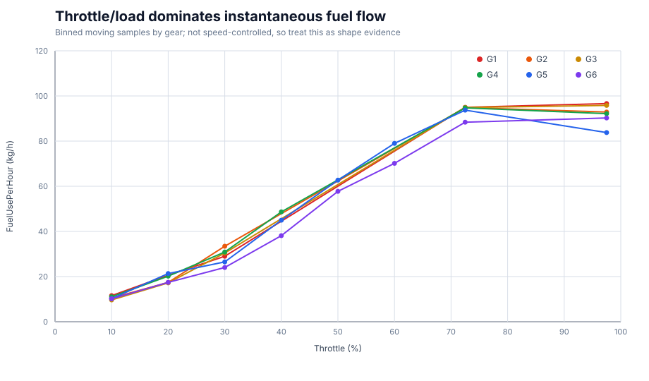
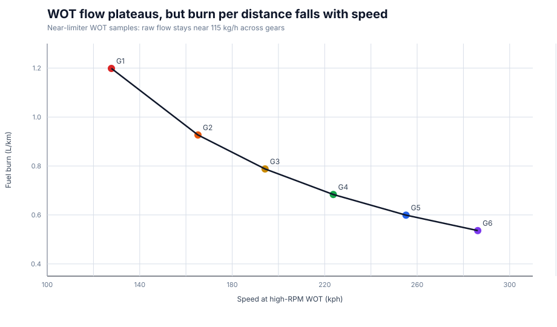
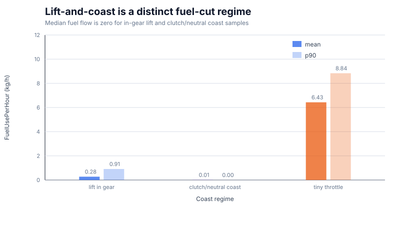

# iRacing Fuel Burn Telemetry Notes

This is a research note for learning how iRacing reports fuel-flow and engine
state telemetry. It is intentionally separate from `fuel-calculator-v2.md`: this
file records observed behavior, useful tests, and interpretation rules. Product
strategy decisions should be promoted into Fuel Calculator docs only after the
behavior is validated.

## Working Interpretation

`FuelUsePerHour` is an instantaneous engine fuel-flow signal in `kg/h`. It is not
fuel per lap, not fuel to finish, and not a standalone efficiency metric.

For combustion captures, convert it to liters with `DriverCarFuelKgPerLtr`:

```text
litersPerHour = FuelUsePerHour / DriverCarFuelKgPerLtr
liters += litersPerHour * deltaSeconds / 3600
```

The useful race metric is distance-integrated burn:

```text
litersPerKm = integratedLiters / distanceKm
litersPerLap = litersPerKm * trackLengthKm
```

`FuelUsePerHour` needs vehicle-state context before it means anything useful:

- `Throttle` / `ThrottleRaw`
- `Clutch` / `ClutchRaw`
- `Gear`
- `RPM` / `Engine0_RPM`
- `Speed`
- `Brake`
- `LapDistPct`, `LapCompleted`, `LapDist`
- `IsOnTrack`, `OnPitRoad`, `PlayerTrackSurface`
- `FuelLevel`

The current pattern is:

- Moving, clutch-engaged samples can make `FuelUsePerHour` useful for flow
  integration.
- Stationary or clutch-disengaged samples can make RPM/throttle look misleading.
- Raw `kg/h` is not fuel efficiency because speed and distance matter.
- Gear is usually not an independent fuel-flow signal. It mostly changes RPM,
  speed, load, and distance covered per unit time.

## Previous Burn Investigation

The first frame-level correlation pass used Dallara P217 and Toyota GR86 race
captures from Nurburgring.

Dallara P217, `capture-20260522-204847-774`, 36,689 usable sampled clean
on-track frames:

| Signal | Corr With `FuelUsePerHour` |
| --- | ---: |
| `Throttle` | 0.990 |
| `RPM` | 0.569 |
| `Speed` | 0.513 |
| `Gear` | 0.474 |
| `RPM * throttle` | 0.996 |

Toyota GR86, `capture-20260523-200213-824`, 32,965 usable sampled clean on-track
frames:

| Signal | Corr With `FuelUsePerHour` |
| --- | ---: |
| `Throttle` | 0.975 |
| `RPM` | 0.516 |
| `Speed` | 0.365 |
| `Gear` | 0.254 |
| `RPM * throttle` | 0.994 |

At near-100% throttle, fuel flow still rose with RPM inside the same gear:

| Capture | Gear | Approx kg/h Per 1000 RPM |
| --- | ---: | ---: |
| Dallara P217 | 1 | 15.7 |
| Dallara P217 | 2 | 15.1 |
| Dallara P217 | 3 | 9.3 |
| Dallara P217 | 4 | 8.1 |
| Dallara P217 | 5 | 7.6 |
| Dallara P217 | 6 | 6.4 |
| Toyota GR86 | 1 | 6.0 |
| Toyota GR86 | 2 | 4.6 |
| Toyota GR86 | 3 | 4.0 |
| Toyota GR86 | 4 | 3.8 |
| Toyota GR86 | 5 | 3.6 |
| Toyota GR86 | 6 | 4.9 |

Same-RPM-bin comparisons reduced the apparent gear effect. For the Dallara P217,
raw WOT gear means ranged from about `94.8` to `106.4 kg/h`, but same-RPM-bin
gear spread was only about `0.7 kg/h` in the 7000-7499 RPM bin and `0.2 kg/h` in
the 7500-7999 RPM bin. For the GR86, matched 500 RPM bins with multiple gears
spread only about `0.3` to `0.7 kg/h`.

The 4-hour GT3 Nurburgring capture gave a cleaner long-straight comparison. In
track-position windows where gear 5 and gear 6 appeared at similar WOT fuel flow,
both gears averaged about `106 kg/h`, but gear 6 was around `265 kph` while gear
5 was around `234-236 kph`. That means gear 6 did not greatly reduce raw fuel
flow, but it did improve fuel per distance because the car covered more distance
per hour.

Race-speed fuel-per-distance examples from clean WOT frames:

| Capture | Gear | L/km | kg/h | Speed |
| --- | ---: | ---: | ---: | ---: |
| Dallara P217 | 1 | 1.202 | 98.7 | 109 kph |
| Dallara P217 | 6 | 0.519 | 106.4 | 274 kph |
| Toyota GR86 | 2 | 0.473 | 37.3 | 105 kph |
| Toyota GR86 | 6 | 0.234 | 38.5 | 219 kph |
| 4h GT3 | 2 | 1.145 | 104.6 | 123 kph |
| 4h GT3 | 6 | 0.537 | 106.0 | 263 kph |

All-throttle race-speed buckets showed the same broad shape:

- Dallara P217: about `0.811-0.902 L/km` around `80-120 kph`, falling to
  `0.501 L/km` at `280-300 kph`.
- Toyota GR86: about `0.357 L/km` around `80-120 kph`, falling to about
  `0.208-0.218 L/km` at `200-240 kph`.
- 4h GT3: about `0.915-0.940 L/km` around `80-120 kph`, falling to
  `0.525 L/km` at `260-280 kph`.

## Daytona Dallara Oval Capture

Source:

```text
v1.2.1-capture/captures/capture-20260525-131952-975
```

Version context: this capture came from the v1.2.1 capture/package folder. The
active product context has since moved to v1.2.2 because issues were noticed in
v1.2.1 by the user and team. Treat the folder name as source provenance for this
fuel-flow sample, not as the current release target.

Context:

- Dallara P217 LMP2
- Daytona International Speedway, 2011 Oval
- Offline Testing
- Track length: `3.9927 km`
- `DriverCarFuelKgPerLtr = 0.750`
- 45,597 frames at 60 Hz
- Capture duration: about 760 seconds

The test had two deliberate phases:

1. Stationary / near-stationary full clutch, 100% throttle, held in each gear for
   around 10 seconds.
2. Full lap in each gear at about 50% throttle.

### Stationary WOT Clutch Holds

Filter used:

```text
Throttle >= 0.95
Clutch <= 0.10
Speed < 15 kph
Gear >= 1
```

Result:

| Gear | Duration | RPM Mean | RPM p10-p90 | FuelUsePerHour | Liters / 10s |
| ---: | ---: | ---: | ---: | ---: | ---: |
| 1 | 13.0s | 7977 | 7917-8035 | 3.88 kg/h | 0.0144 |
| 2 | 10.7s | 7977 | 7919-8034 | 3.79 kg/h | 0.0140 |
| 3 | 11.6s | 7976 | 7919-8034 | 3.79 kg/h | 0.0140 |
| 4 | 12.8s | 7977 | 7919-8034 | 3.79 kg/h | 0.0140 |
| 5 | 13.1s | 7976 | 7918-8034 | 3.79 kg/h | 0.0140 |
| 6 | 11.1s | 8476 | 8419-8533 | 3.79 kg/h | 0.0140 |

This is the weird but useful result: with the clutch disengaged, WOT and high RPM
do not produce race-load fuel flow. The selected gear also does not matter much
because the engine is not doing meaningful work through the drivetrain.

Interpretation:

- `RPM * throttle` is not a universal fuel model.
- Clutch/load/moving context is required before interpreting fuel flow.
- Stationary clutch-in free-revving should be excluded from race-burn and
  formation-burn learning.
- This state is still useful as diagnostics because it proves the telemetry can
  distinguish unloaded engine burn from loaded driving burn.

### 50% Throttle Gear Laps

Filter used:

```text
0.43 <= Throttle <= 0.57
Speed > 20 kph
Gear >= 1
IsOnTrack
not OnPitRoad
```

Flow integration matched tank-level deltas closely.

| Gear | Duration | Laps | Speed | RPM | FuelUsePerHour | L/lap Flow | L/lap Tank |
| ---: | ---: | ---: | ---: | ---: | ---: | ---: | ---: |
| 1 | 156.7s | 1.40 | 128.1 kph | 7938 | 65.9 kg/h | 2.740 | 2.717 |
| 2 | 86.9s | 1.00 | 165.3 kph | 7924 | 70.1 kg/h | 2.261 | 2.229 |
| 3 | 73.9s | 1.00 | 194.1 kph | 7938 | 71.1 kg/h | 1.954 | 1.922 |
| 4 | 64.3s | 1.00 | 223.2 kph | 7918 | 71.6 kg/h | 1.710 | 1.679 |
| 5 | 59.0s | 1.00 | 242.4 kph | 7525 | 72.9 kg/h | 1.603 | 1.571 |
| 6 | 63.9s | 1.05 | 235.8 kph | 6556 | 64.6 kg/h | 1.459 | 1.432 |

Notes:

- Gear 1 included extra approach/partial-lap distance, but the flow/tank
  agreement is still close.
- Raw `kg/h` is broadly similar in gears 2-5, but `L/lap` drops sharply as speed
  rises and distance covered per second improves.
- Gear 6 used lower RPM and lower flow than gear 5 in this test, but it was also
  slightly slower than gear 5. It still had the lowest `L/lap`.
- The tank-delta and flow-integrated results were within roughly `0.03 L/lap` in
  each segment, which is strong evidence that `FuelUsePerHour` can become useful
  for sector/lap estimation after calibration.

Moving, clutch-engaged correlation in this capture:

| Signal | Corr With `FuelUsePerHour` |
| --- | ---: |
| `Throttle` | 0.877 |
| `RPM` | 0.739 |
| `RPM * throttle` | 0.986 |
| `Speed` | 0.484 |
| `Gear` | 0.175 |
| `ManifoldPress` | 0.808 |

The same capture's stationary clutch-in WOT phase collapsed to about `3.8 kg/h`,
so those moving correlations should only be used in a loaded, clutch-engaged,
distance-valid context.

## Daytona Dallara Oval Fuel Test V2

Source:

```text
fuel test v2/captures/capture-20260525-182213-419
```

Context:

- Dallara P217 LMP2
- Daytona International Speedway, 2011 Oval
- Offline Testing
- Track length: `3.9927 km`
- `DriverCarFuelKgPerLtr = 0.750`
- 95,760 frames at 60 Hz
- Capture duration: about 1,596 seconds / 26.6 minutes

The test added the missing controlled cases from the previous capture:

1. Same speed, different gear.
2. Same gear, different throttle/load.
3. WOT acceleration pulls.
4. Coast / lift tests.

Derived evidence lives in:

```text
docs/assets/fuel-burn/
```





No manual phase labels were present in the metadata, so these windows are
inferred from speed, gear, throttle, pit-road, and fuel-flow patterns:

| Phase | Session Time | Observation |
| --- | ---: | --- |
| Pit/out staging | 28.7-77.1s | Initial pit window; fuel level becomes reliable |
| 100 kph gear sweep | 96.0-435.0s | G1-G6 same-speed/different-gear comparison |
| 150 kph gear sweep | 444.0-565.0s | G2-G6 same-speed/different-gear comparison |
| 195/224/250 kph sweeps | 575.0-754.0s | Higher-speed gear comparisons with some WOT segments |
| 120 kph gear sweep | 792.0-842.0s | Short G2-G6 comparison |
| WOT/coast staircase | 920.0-1488.0s | Repeated WOT pulls and coast-downs |
| 96 kph WOT sweep | 1515.0-1566.0s | G1-G6 100% throttle at pit-limiter speed |
| End pit/garage | 1619.8-1624.9s | Final pit/garage state |

### Flow Integration Cross-Check

Across valid moving, on-track intervals:

| Metric | Value |
| --- | ---: |
| Valid distance | 64.1725 km |
| Flow-integrated burn | 27.2230 L |
| Tank delta | 27.2915 L |
| Difference | -0.0685 L |
| Mean burn | 0.4242 L/km |
| Daytona oval equivalent | 1.6938 L/lap |

The history summary for the same capture reported `15` completed valid laps,
`16.1` valid distance laps, `27.15 L` used, and `1.69 L/lap` average, which is
consistent with the frame-level integration.

This is stronger than the v1.2.1 segment check because it spans the whole v2
test capture. `FuelUsePerHour` is still instantaneous `kg/h`, but integrating it
over valid time agrees very closely with `FuelLevel` movement.

Moving, clutch-engaged, positive-flow correlation in this capture:

| Signal | Corr With `FuelUsePerHour` |
| --- | ---: |
| `Throttle` | 0.868 |
| `RPM` | 0.708 |
| `RPM * throttle` | 0.990 |
| `Speed` | 0.666 |
| `Gear` | 0.195 |
| `ManifoldPress` | 0.865 |

The same warning from the clutch-in test still applies: this relationship is
valid only for loaded, moving samples. Stationary free-revving and coasting are
separate regimes.

### Same Speed, Different Gear



Stable same-speed windows show that gear/RPM matter when speed is controlled:

| Scenario | Gear | Speed | Throttle | RPM | FuelUsePerHour | L/km |
| --- | ---: | ---: | ---: | ---: | ---: | ---: |
| 100 kph partial | 1 | 100.2 kph | 17.5% | 6202 | 18.01 kg/h | 0.2397 |
| 100 kph partial | 2 | 100.0 kph | 17.1% | 4787 | 14.27 kg/h | 0.1903 |
| 100 kph partial | 3 | 100.4 kph | 17.7% | 4095 | 13.77 kg/h | 0.1830 |
| 100 kph partial | 4 | 100.0 kph | 14.2% | 3536 | 11.55 kg/h | 0.1541 |
| 100 kph partial | 5 | 100.1 kph | 12.3% | 3094 | 10.41 kg/h | 0.1387 |
| 100 kph partial | 6 | 99.9 kph | 11.9% | 2765 | 10.21 kg/h | 0.1364 |
| 150 kph partial | 2 | 150.3 kph | 25.3% | 7204 | 31.75 kg/h | 0.2817 |
| 150 kph partial | 3 | 149.9 kph | 26.2% | 6120 | 27.38 kg/h | 0.2436 |
| 150 kph partial | 4 | 149.9 kph | 25.4% | 5308 | 25.55 kg/h | 0.2272 |
| 150 kph partial | 5 | 149.8 kph | 30.0% | 4635 | 24.36 kg/h | 0.2168 |
| 150 kph partial | 6 | 149.7 kph | 32.4% | 4150 | 24.24 kg/h | 0.2160 |
| 96 kph WOT | 1 | 95.9 kph | 100.0% | 5958 | 82.40 kg/h | 1.1454 |
| 96 kph WOT | 2 | 96.0 kph | 100.0% | 4608 | 58.00 kg/h | 0.8053 |
| 96 kph WOT | 3 | 96.0 kph | 100.0% | 3929 | 47.90 kg/h | 0.6650 |
| 96 kph WOT | 4 | 96.0 kph | 100.0% | 3403 | 40.39 kg/h | 0.5608 |
| 96 kph WOT | 5 | 96.1 kph | 100.0% | 2975 | 34.50 kg/h | 0.4788 |
| 96 kph WOT | 6 | 96.1 kph | 100.0% | 2667 | 30.37 kg/h | 0.4215 |

The partial-throttle 100 and 150 kph samples show the expected pattern: higher
gear usually means lower RPM and lower fuel flow at the same speed. The effect
is not a pure "gear" input; it is mostly the engine/load state created by
choosing that gear.

The 96 kph WOT comparison is the clearest proof that `RPM * throttle` is still a
good loaded-flow explanation after excluding clutch-in free-revving. Same speed
and same throttle produce very different fuel flow because RPM changes from
about `5958` in gear 1 to `2667` in gear 6.

### Same Gear, Different Throttle



The throttle-bin graph is not speed-controlled, so it should not be read as a
strategy map. It is still useful shape evidence: once the car is moving and the
clutch is engaged, fuel flow climbs strongly with throttle/load, with RPM and
speed explaining much of the spread inside each throttle band.

For product logic this argues against using gear alone for any live advice.
Throttle/load/RPM explain instantaneous flow; distance and track position decide
whether that flow matters for stint strategy.

### WOT Acceleration Pulls



Near limiter, raw WOT fuel flow is almost flat across gears:

| Gear | Speed | RPM | FuelUsePerHour | L/km |
| ---: | ---: | ---: | ---: | ---: |
| 1 | 127.8 kph | 7958 | 114.85 kg/h | 1.1986 |
| 2 | 165.2 kph | 7955 | 114.83 kg/h | 0.9268 |
| 3 | 194.2 kph | 7949 | 114.76 kg/h | 0.7879 |
| 4 | 223.7 kph | 7940 | 114.70 kg/h | 0.6836 |
| 5 | 255.2 kph | 7933 | 114.66 kg/h | 0.5991 |
| 6 | 286.2 kph | 7975 | 115.07 kg/h | 0.5361 |

This matches the earlier Nurburgring findings: WOT near limiter does not become
meaningfully lower-flow just because the car is in a higher gear. The efficiency
improvement is distance per unit time. At the same raw flow, gear 6 covers much
more ground than gear 1, so `L/km` drops hard.

The clean through-gears WOT pull appears around `920.7-975.7s` and runs from
about `118 kph` to `293 kph`. The individual WOT gear pulls from low speed
appear around `993.7-1168.4s`. These are the loaded comparisons that the earlier
clutch-in WOT test could not provide.

### Coast Tests



| Regime | Duration | Speed Mean | FuelUsePerHour Mean | P50 | P90 | Max |
| --- | ---: | ---: | ---: | ---: | ---: | ---: |
| Lift in gear | 146.1s | 150.1 kph | 0.275 kg/h | 0.000 | 0.909 | 3.920 |
| Clutch/neutral coast | 8.3s | 181.0 kph | 0.008 kg/h | 0.000 | 0.000 | 3.897 |
| Tiny throttle | 15.8s | 111.5 kph | 6.432 kg/h | 7.190 | 8.835 | 10.531 |

Lift-and-coast is visible as a fuel-cut regime. Median flow is zero for
in-gear lift and for the clutch/neutral coast samples. Tiny maintenance throttle
is not fuel cut; even the small throttle bucket averaged `6.4 kg/h`.

This should be modeled separately from normal race-speed burn. If coast samples
are mixed into a normal lap average without labeling the regime, they can make a
driver look more fuel-efficient than their powered segments actually are.

The strongest single coast window appears around `1443.3-1453.2s`: gear 6,
roughly `285 kph` down to `177 kph`, and `0 L/h` fuel flow. That is useful live
evidence for lift-and-coast behavior, but it is not evidence that powered fuel
burn changed.

## Product-Relevant Lessons

- `FuelUsePerHour` should be a flow-integration input, not a direct strategy
  output.
- Valid flow-derived sector/lap burn should require moving, clutch-engaged,
  on-track, non-pit context with usable time and distance.
- Flow integration should be calibrated against `FuelLevel` deltas before it can
  influence fuel strategy. The v2 Daytona capture matched within `0.069 L` over
  about `27.3 L` of observed burn.
- Tank deltas remain the strongest completed-lap truth source.
- Gear/RPM/speed can explain fuel behavior, but they should not become strategy
  commands until repeated captures prove the advice is stable and useful.
- Formation/caution burn and race-speed burn should remain separate families.
  Fixed-speed pacing can care about target speed and gear; race-speed strategy
  cares about integrated sector/lap burn under real driving conditions.
- Coast / fuel-cut samples should be classified separately from powered burn.
  They are real fuel usage, but they are not evidence that the driver's normal
  powered lap burn has improved.

## Further Oval Tests

The v2 capture covered the first useful isolation tests. The next useful tests
should repeat the surprising cases and add lap/sector shapes that look more like
race usage.

### Same-Speed Repeat / A-B-A

Repeat the fixed-speed comparisons in A-B-A shape so the result is less exposed
to fuel load, tire state, wind, and line variation:

```text
gear 5 at 150 kph
gear 6 at 150 kph
gear 5 at 150 kph again
```

Useful targets:

| Target Speed | Candidate Gears |
| ---: | --- |
| 100 kph | 1 / 2 / 3 / 4 / 5 / 6 |
| 150 kph | 2 / 3 / 4 / 5 / 6 |
| 200 kph | 3 / 4 / 5 / 6 |
| 240 kph | 4 / 5 / 6 |

The v2 capture has good 100 and 150 kph evidence. More 200 and 240 kph repeats
would help decide whether the low-speed pattern persists at race-like Daytona
speeds.

### Same-Gear Throttle Ladders

For each chosen gear, hold longer clean segments at:

- 25% throttle
- 50% throttle
- 75% throttle
- 100% throttle

The v2 capture has enough mixed throttle data to prove the shape, but longer
deliberate holds would give a cleaner load curve because speed and RPM move less
inside each bucket.

### WOT Pull Repeats

In gears 3-6, start from lower RPM and go WOT to near shift light / limiter.
The v2 capture already shows the high-RPM plateau near `115 kg/h`; repeats would
mostly improve confidence and expose whether draft, wind, or setup changes move
the plateau.

### Race-Lap Coast Shapes

At high speed, compare longer lap-shaped patterns:

- normal lift-and-coast at corner entry;
- clutch in, no throttle;
- neutral, no throttle if practical;
- tiny maintenance throttle, such as 5-10%;
- powered corner exit after each coast pattern.

This would show how much fuel-cut behavior should be allowed into sector-level
live estimates without making the historical powered-burn model too optimistic.

### Formation / Pace-Speed Tests

Hold low-speed targets in different gears:

| Target Speed | Candidate Gears |
| ---: | --- |
| 80 kph | 1 / 2 / 3 |
| 100 kph | 1 / 2 / 3 |
| 120 kph | 2 / 3 / 4 |

This directly supports formation-lap and caution-lap fuel learning.

## Capture Guidance

To make future captures easier to segment:

- Hold each segment for at least 15-20 seconds; full laps are better when safe.
- Add a clear separator between tests, such as 2-3 seconds of zero throttle.
- Use `DriverMarker` if bound.
- Keep the car on the same line when comparing gears at the same speed.
- Avoid pit road, apron transitions, wall contact, and major steering changes
  during measurement segments.
- Use repeated segments when the result is surprising.
